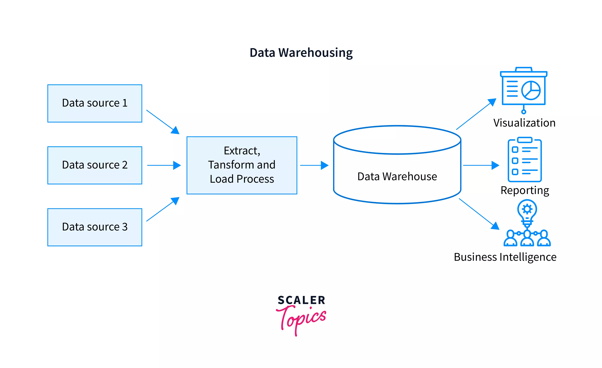

# DATA WAREHOUSING

A Data warehouse is a centralized location, where all your gets stored for further analysis.

 A data warehouse can be divided into four different stages :

1.collect  
2.Store  
3.Analyze  
4.Consume  

## COLLECT: 

At this stage we collect data from our source systems in its raw farm

## STORE:
The data received is stored in a layer called Stagging Layer, All the process is done by using ETL(EXTRACTION TRANSFORMATION AND LOADING)

## ANALYZE:
Then we analyze the data, and what kind of inside we want from the data, coming from the disparate systems in the raw form. Then we do a transformation of the data.

## CONSUME:
It is a layer where we see all the graphs (done by using TABLU) to explore the data

### How does a data warehouse work?
1. A data warehouse may contain multiple databases. Within each database, data is organized into tables and columns.

2. Within each column, you can define a description of the data, such as integer, data field, or string.

3. Tables can be organized inside schemas, which you can think of as folders. When data is ingested, it is stored in various tables described by the schema.

4. Query tools use the schema to determine which data tables to access and analyze.

## Data Warehouse Architecture :

The architecture of a data warehouse is determined by the organization’s specific needs. Common architectures include.

<ul>
    <li><b>Simple:</b>All data warehouses share a basic design in which metadata, summary data, and raw data are stored within the central repository of the warehouse. The repository is fed by data sources on one end and accessed by end users for analysis, reporting, and mining on the other end.</li>
    <li><b>Simple with a staging area:</b> Operational data must be cleaned and processed before being put in the warehouse. Although this can be done programmatically, many data warehouses add a staging area for data before it enters the warehouse, to simplify data preparation</li>
    <li><b>Hub and spoke:</b> Adding data marts between the central repository and end users allows an organization to customize its data warehouse to serve various lines of business. When the data is ready for use, it is moved to the appropriate data mart.</li>
    <li><b>Sandboxes:</b> Sandboxes are private, secure, safe areas that allow companies to quickly and informally explore new datasets or ways of analyzing data without having to conform to or comply with the formal rules and protocol of the data warehouse.</li>
</ul>

### What are the benefits of using a data warehouse?

The benefits of a data warehouse include the following:

<ul>
    <li>Informed decision making</li>
    <li>Consolidated data from many sources</li>
    <li>Historical data analysis</li>
    <li>Data quality, consistency, and accuracy</li>
    <li>Separation of analytics processing from transactional databases, which improves the performance of both systems</li>
</ul>

## References:

1. https://www.youtube.com/watch?v=jmwGNhUXn_o

2. https://aws.amazon.com/data-warehouse/#:~:text=A%20data%20warehouse%20is%20a,typically%20on%20a%20regular%20cadence.

3. https://www.oracle.com/database/what-is-a-data-warehouse/

